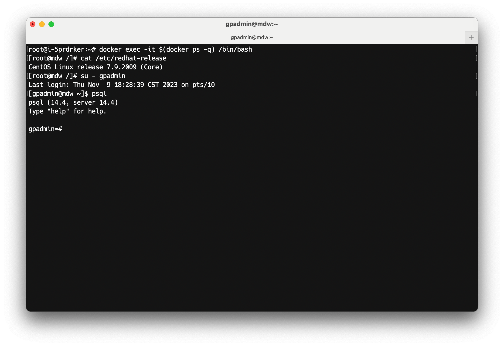

Hello there! Thank you for joining us for the November newsletter of the Cloudberry Database project!

We are thrilled to have you as a part of our community. In this newsletter, we will be sharing the latest updates, improvements, and contributions made by our incredible members. We have a lot to talk about, from exciting new features to bug fixes, so let's dive right in!

## Highlight: Cloudberry Database Bootcamp

A few weeks ago, we announced the [Cloudberry Database Bootcamp](https://github.com/cloudberrydb/bootcamp) program, a comprehensive program that provides a hands-on experience with Cloudberry Database. It is tailored to help you understand Cloudberry Database's capabilities and features a range of materials, including tutorials, sample code, and crash courses. If you're new to Cloudberry Database, this bootcamp is the perfect place to begin. You can check the [Announcement blog post](/blog/introducing-cloudberrydb-bootcamp) for more details.

## Pull Requests

-   [Feature: add user-defined index access method #315](https://github.com/cloudberrydb/cloudberrydb/pull/315)  by @hw118118
-   [Judge whether commands need to be dispatched to QEs in QD #314](https://github.com/cloudberrydb/cloudberrydb/pull/314)  by @wenchaozhang-123
-   [make main_manifest table not shared #311](https://github.com/cloudberrydb/cloudberrydb/pull/311)  by @roseduan
-   [Fix: enable trigger throught FDW in the serverless architecture. #309](https://github.com/cloudberrydb/cloudberrydb/pull/309)  by @lss602726449
-   [[Bug][github-actions] icw-parallel-test add MAX_CONNECTIONS #308](https://github.com/cloudberrydb/cloudberrydb/pull/308)  by @smartyhero
-   [Add pg_upgrade and gpAdminLogs log to CI failure artifact #306](https://github.com/cloudberrydb/cloudberrydb/pull/306)  by @Ray-Eldath
-   [Add interface and export struct to public. #304](https://github.com/cloudberrydb/cloudberrydb/pull/304)  by @HuSen8891
-   [Doc: update the terminal info to CloudberryDB #300](https://github.com/cloudberrydb/cloudberrydb/pull/300)  by @tuhaihe
-   [Answer Query Using Materialized Views #298](https://github.com/cloudberrydb/cloudberrydb/pull/298)  by @avamingli
-   [Fix bug deduplicate elemlist is null when elemlist size is 1. #297](https://github.com/cloudberrydb/cloudberrydb/pull/297)  by @MisterRaindrop
-   [Support cloud manager #296](https://github.com/cloudberrydb/cloudberrydb/pull/296)  by @roseduan
-   [Use pg_class instead of gp_segment_configuration to test Entry. #294](https://github.com/cloudberrydb/cloudberrydb/pull/294)  by @avamingli
-   [Rename GP parallel words to CBDB parallel. #293](https://github.com/cloudberrydb/cloudberrydb/pull/293)  by @avamingli
-   [Fix explain bad indent when showing operatorMem. #292](https://github.com/cloudberrydb/cloudberrydb/pull/292)  by @avamingli
-   [Provide gpdemo.sh deployment script #291](https://github.com/cloudberrydb/cloudberrydb/pull/291)  by @Ray-Eldath
-   [Modify internal address in deploy/vagrant #290](https://github.com/cloudberrydb/cloudberrydb/pull/290)  by @Zhangbaowen-Hashdata
-   [Revert "Fix explain bad indent when showing operatorMem." #289](https://github.com/cloudberrydb/cloudberrydb/pull/289)  by @avamingli
-   [Fix explain bad indent when showing operatorMem. #288](https://github.com/cloudberrydb/cloudberrydb/pull/288)  by @avamingli
-   [Doc: update pull request template for CBDB #287](https://github.com/cloudberrydb/cloudberrydb/pull/287)  by @tuhaihe
-   [Add cache invaladation synchronization amoung QD and QEs. #286](https://github.com/cloudberrydb/cloudberrydb/pull/286)  by @wenchaozhang-123
-   [Add motionhazard to the outer side of parallel aware join.(fix flaky incorrect results of agg) #284](https://github.com/cloudberrydb/cloudberrydb/pull/284)  by @avamingli
-   [Reduce external-fts CI pipeline to only icw-test #282](https://github.com/cloudberrydb/cloudberrydb/pull/282)  by @Ray-Eldath

## Issues

-   [[Bug] abscissa type not supported, from sqlancer test #317](https://github.com/cloudberrydb/cloudberrydb/issues/317)  by @congxuebin
-   ['Parallel Safety' in CBDB style parallel plan #307](https://github.com/cloudberrydb/cloudberrydb/issues/307)  by @avamingli
-   [[Bug] regress/aggregates_optimizer due to gporca fallback #302](https://github.com/cloudberrydb/cloudberrydb/issues/302)  by @Ray-Eldath
-   [[Bug] Cluster down during regress/createdb #301](https://github.com/cloudberrydb/cloudberrydb/issues/301)  by @Ray-Eldath
-   [[Bug] explain data change on operatorMem, mpp22698 test failed #295](https://github.com/cloudberrydb/cloudberrydb/issues/295)  by @congxuebin
-   [[Bug] unexpected reltuples number in pg_class after delete and vacuum  #273](https://github.com/cloudberrydb/cloudberrydb/issues/273)  by @congxuebin
-   [[Bug] failed assertion "mp != nullptr" in CMemoryPoolManager.cpp::Destroy (gporca/libgpos) #285](https://github.com/cloudberrydb/cloudberrydb/issues/285)  by @Ray-Eldath
-   [[Bug] regress/stats test failure on external_fts #281](https://github.com/cloudberrydb/cloudberrydb/issues/281)  by @Ray-Eldath
-   [[Bug] There is a problem with the distribution strategy of the orca unionall operator. #279](https://github.com/cloudberrydb/cloudberrydb/issues/279)  by @Light-City

## Website

Currently, we are working on the new version of the Cloudberry Database website, which will have a fresh and modern design in the upcoming weeks. Additionally, we are diligently working on the Cloudberry Database user documentation. Stay tuned for more exciting news! 

## Contributors

🎈️🎊️ Thanks to the following contributors for helping make Cloudberry Database better this month:

> @wenchaozhang-123, @hw118118, @roseduan, @lss602726449, @smartyhero, @HuSen8891, @Ray-Eldath, @tuhaihe, @avamingli, @MisterRaindrop, @Zhangbaowen-Hashdata, @congxuebin, @Light-City, @ginobiliwang, @TomShawn, @RyanWei, @liang8283

## Join us

The Cloudberry Database community welcomes everyone to contribute, regardless of their level of experience. We encourage all types of contributions, no matter how small. Our [contribution guide](https://cloudberrydb.org/contribute/how-to-contribute) is available to help you get started with the process.

In addition, we offer various channels for community members to discuss, seek help, provide feedback, and chat. You can find support [here](https://cloudberrydb.org/support).

Join us and be part of our community!
