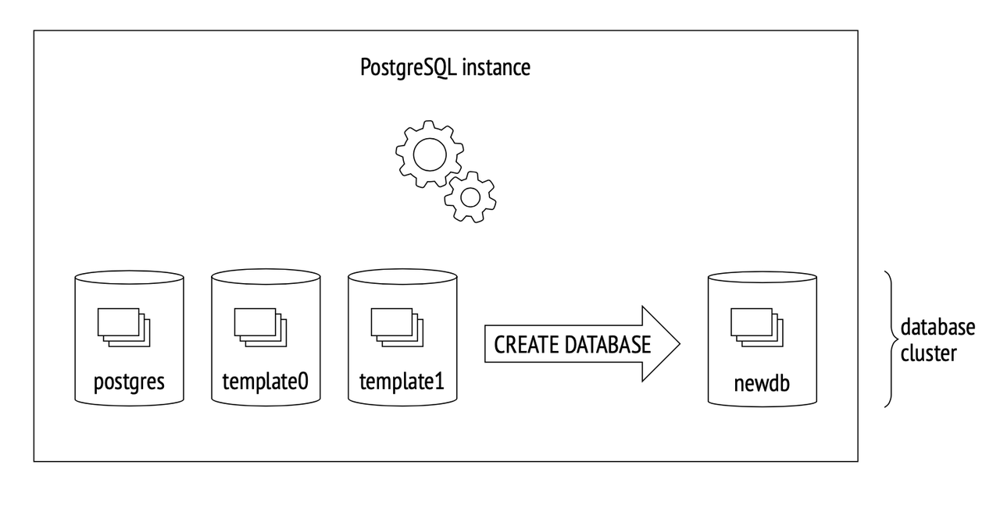
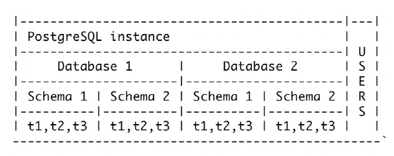
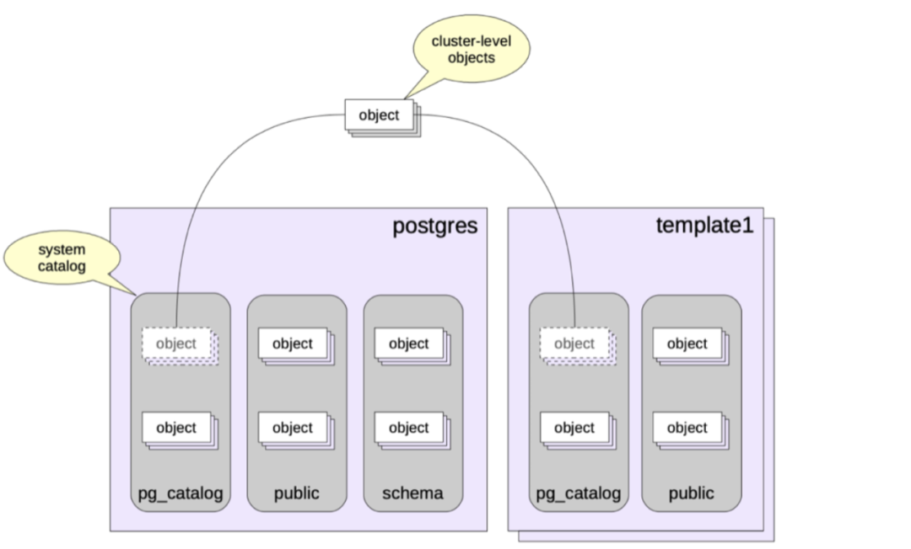
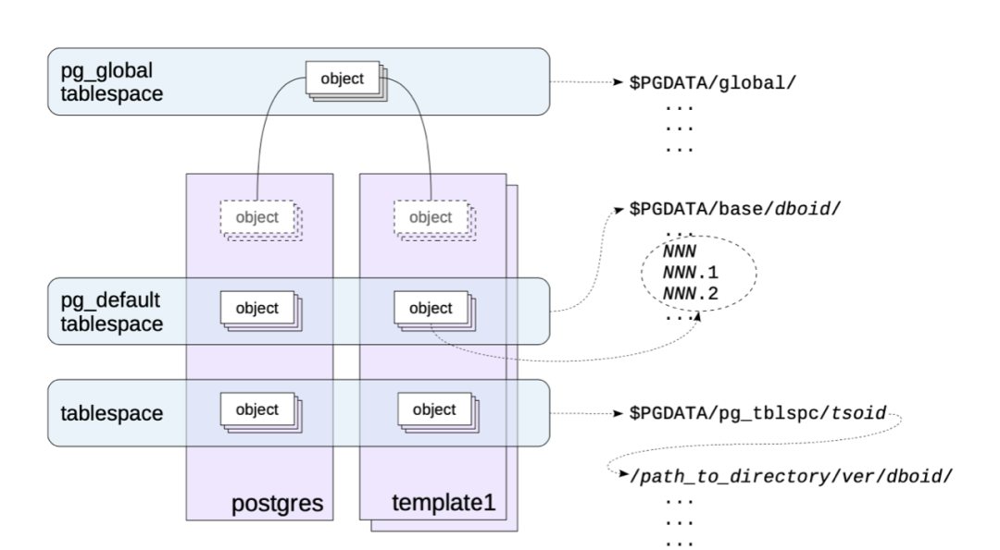
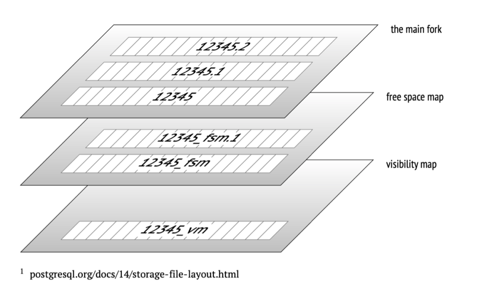

PostgreSQL, often referred to as PG, stands out as one of the most powerful open-source databases. It has undergone rapid technological advancements in recent years, repeatedly earning the prestigious title of "DBMS of the Year" in the DB-Engines rankings.

PG excels in supporting queries for both relational and non-relational data, providing developers with a diverse range of functionalities. It not only aids in application development but also empowers administrators to ensure data integrity. With a legacy spanning over two decades of community-driven development, PG has honed its capabilities in fault recovery, integrity, and precision.

In this article, we delve into the secret of PG data organization.

<!-- truncate -->

_Source: PostgreSQL 14 Internals._

## Data organization in PostgreSQL

During PG initialization, three databases are automatically created: `template0`, `template1`, and the `postgres` database. Users can also create their own databases.

- `template0` remains immutable, serving the purpose of initiating a clean environment during system recovery.
- `template1` acts as a template when users create a new database. Users can customize tables and components based on `template1`, and the newly created database inherits these components.

PG introduces the concept of namespaces, known as schemas, to mitigate naming conflicts between objects (e.g., tables) with identical names within the same database. Notably, schemas are specific to each database.

_Source: PostgreSQL 14 Internals._

Taking the provided diagram as an example, `Database 1` and `Database 2` each have `Schema 1` and `Schema 2`, containing tables named `t1`, `t2`, and `t3`. Despite identical table names, the different schemas prevent conflicts.

Certain schemas are embedded in the system, such as `public`, `pg_catalog`, `information_schema`, and `pg_toast`. Notably, PG metadata and tables reside in the `pg_catalog` schema, housing system tables, indexes, built-in data types, functions, and more. For system tables, `pg_class` stores table descriptions, `pg_database` stores information about PG-created databases, and `pg_am` is used for storing metadata related to table access functions.

_Source: PostgreSQL 14 Internals._

For user-specified tables, PostgreSQL determines the schema to which the tables belong using the configuration parameter `search_path`. The `search_path` is a comma-separated list of schemas. Users can specify the priority order of the schema list by setting the `search_path`, with priority decreasing from left to right. If none of the schemas in the `search_path` contains a matching table name, an error is reported, even if there are matching table names in other schemas within the database.

_Source: PostgreSQL 14 Internals._

## PostgreSQL file layout

Physically, PostgreSQL introduces the concept of tablespaces to specify storage paths for tables. The default system tablespace is named `pg_default`, and users can customize tablespaces as per their requirements.

_Source: PostgreSQL 14 Internals._

From the diagram above, the `pg_global` tablespace is mapped to the path `$PGDATA/global`, the `pg_default` tablespace is mapped to `$PGDATA/base/`, and user-defined tablespaces are mapped to `$PGDATA/pg_tblspc/`. Additionally, tablespaces can be leveraged to segregate hot and cold data, with hot data stored on SSD-associated paths and cold data on SATA disk-associated paths.

_Source: PostgreSQL 14 Internals._

As files grow larger, PostgreSQL creates a new file with the same fork when it reaches 1GB. Typically, each table's file collection corresponds to multiple suffix fork files. The main fork stores actual data, including table and index rows. This main fork is applicable to any relationship (excluding data-less views). Files are usually divided into 1GB-sized segments to ensure compatibility with various file systems, acknowledging that some file systems may struggle with larger files.

To manage free space within files, PostgreSQL introduces the concept of a Free Space Map (FSM) file, which tracks the location information of internal free space within data pages. PostgreSQL dynamically maintains the content of the Free Space Map file. For example, after performing data reclamation through `Vacuum`, it records information about newly available free pages in the Free Space Map file, facilitating quick reuse of reclaimed free pages in the future.

Additionally, the visibility map records whether data in a page is "visible," freeing the need for MVCC visibility checks on each row individually within the page. This significantly enhances data scanning performance.

## PostgerSQL in-page data storage and TOAST

In PostgreSQL, the default page size is 8KB. When a tuple (similar to a row in a table) becomes exceptionally large and cannot fit within a page, PostgreSQL employs a technique called TOAST (The Oversized-Attribute Storage Technique). For the oversized attributes, PostgreSQL introduces various storage strategies.

TOAST strategies:

- **PLAIN**: Avoids compression and out-of-row storage. This strategy is only permitted for data types that can be stored without using TOAST, such as integer types. It is not allowed for types like text that require storage lengths exceeding the page size.
- **EXTENDED**: Allows compression and out-of-line storage. Typically, it first attempts compression, resorting to out-of-line storage if the data remains too large.
- **EXTERNAL**: Permits out-of-row storage but disallows compression. This strategy might offer higher performance for fields like strings that operate on a portion of the data, avoiding the need to read the entire row data and then decompress.
- **MAIN**: Allows compression but disallows out-of-line storage. In practice, out-of-line storage might still be initiated as a last resort when other methods (such as compression) fail to meet the requirements for storing excessively large data. Therefore, it is more accurate to understand it as an approach to minimize the use of out-of-line storage is more accurate.

In general, to ensure storage density, PostgreSQL aims to store at least four tuples on one page (with an 8KB page size). Theoretically, the maximum tuple size threshold is determined by the formula: (8KB - page header) / 4. When employing TOAST storage, the following algorithmic principles are sequentially applied, stopping immediately when the row no longer exceeds the threshold:

1.  Starting from the "longest" attribute to the "shortest" attribute, attributes are traversed using "EXTERNAL" and "EXTENDED" strategies. If the EXTENDED attribute is compressed (if valid) and if the value itself exceeds one-fourth of the page, it is immediately sent to the TOAST table. The handling of External attributes is similar but without compression.
2.  If the row version still does not fit the page after the first pass, the remaining attributes with "EXTERNAL" and "EXTENDED" strategies are transferred to the TOAST table.
3.  If this does not help either, an attempt can be made to compress the attributes with the "MAIN" strategy but keep them in the table's pages.
4.  Only after step 3, if the row is still not short enough, can attributes with the "MAIN" strategy enter the TOAST table.

Sometimes it can be useful to change the strategy for certain columns. For example, if it is known in advance that data in a column cannot be compressed, setting the "EXTERNAL" strategy for that column can help avoid unnecessary compression attempts, thus saving time. Note that TOAST is applicable only to tables and not to indexes. This imposes limitations on the size of keys to be indexed.

As a data warehouse fully compatible with the PostgreSQL ecosystem, Cloudberry Database extends new storage engines on top of PostgreSQL, such as AO tables, a vectorized execution engine based on Arrow, and columnar storage engines, further enhancing system performance. Rooted in open source and committed to contributing back to the open-source community, Cloudberry Database focuses on the research and innovation of data warehouses. Cloudberry Database aims to drive the development of open-source technologies, transition from open-source users to contributors and leaders, and create a world-class data warehouse platform.
