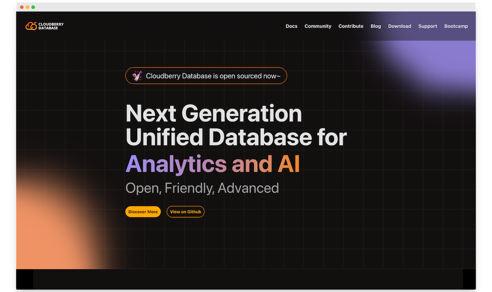

Hello, welcome to the first issue of our community newsletter for 2024. In this newsletter, I'll share the latest updates on the Cloudberry Database project and the community.

## Highlights

### Cloudberry Database Roadmap 2024

We have just released the Cloudberry Database Roadmap for 2024 and you can find it on [GitHub Discussions #369](https://github.com/orgs/cloudberrydb/discussions/369). The roadmap outlines the milestones for the Cloudberry Database project in 2024, including features and enhancements, kernel updates, streaming, lakehouse, AI/ML, ecosystem, and release plan.

We would be delighted if you could join us in shaping the future of Cloudberry Database. We welcome your thoughts and ideas, so feel free to share them.

### New fresh-look Website

At the beginning of 2024, we launched our new Cloudberry Database website which has a fresh and modern design. We are confident that you will have an excellent browsing experience on the website. In case you have any suggestions, please feel free to let us know.

In the coming months, we will introduce support for responsive layout, light mode, and more features. Please stay tuned for these updates.

## Pull Requests

- Fix: unstable ao vacuum icw test [#376](https://github.com/cloudberrydb/cloudberrydb/pull/376) by @jiaqizho
- Don't inherit parent's reloptions if child partition's AM differs [#375](https://github.com/cloudberrydb/cloudberrydb/pull/375)  by @yjhjstz
- Extend a new AM method to do acquire sample rows. [#374](https://github.com/cloudberrydb/cloudberrydb/pull/374)  by @wenchaozhang-123
- Fix configue not consistent with configure.ac [#373](https://github.com/cloudberrydb/cloudberrydb/pull/373)  by @lss602726449
- Fix CopyCreateStmtFields, lost intoPolicy field. [#372](https://github.com/cloudberrydb/cloudberrydb/pull/372)  by @yjhjstz
- As ci will failed in upterm stage, revert it now. [#371](https://github.com/cloudberrydb/cloudberrydb/pull/371)  by @wenchaozhang-123
- [AQUMV] Use view's TupleDesc to construct final columns. [#366](https://github.com/cloudberrydb/cloudberrydb/pull/366)  by @avamingli
- Fix AO/AOCS insertDesc memory issue. [#365](https://github.com/cloudberrydb/cloudberrydb/pull/365)  by @avamingli
- Fix greenplum_path.sh change PATH [#363](https://github.com/cloudberrydb/cloudberrydb/pull/363)  by @Ray-Eldath
- make  `shareinput_Xslice_dsm_handle_ptr`  and  `shareinput_Xslice_hash`  non-static [#361](https://github.com/cloudberrydb/cloudberrydb/pull/361)  by @shmiwy
- [Answer Query Using Materialized Views] Support ORDER BY in origin query [#358](https://github.com/cloudberrydb/cloudberrydb/pull/358)  by @avamingli
- [AQUMV] Avoid misbehaviors that are not supported currently. [#357](https://github.com/cloudberrydb/cloudberrydb/pull/357)  by @avamingli
- gpssh: removing b and \r getting added to command output [#355](https://github.com/cloudberrydb/cloudberrydb/pull/355)  by @wenchaozhang-123
- [Answer Query Using Materialized Views] Support HAVING clause in origin query [#354](https://github.com/cloudberrydb/cloudberrydb/pull/354)  by @avamingli

## Issues

- [Bug] a table specified with "appendonly=true, orientation=column" appears not as an ao table [#368](https://github.com/cloudberrydb/cloudberrydb/issues/368)  by @congxuebin
- [Bug] Copy from will fail when talble is ao_row [#364](https://github.com/cloudberrydb/cloudberrydb/issues/364)  by @shmiwy
- ERROR: found two entries in pg_aocsseg_73427122 [#362](https://github.com/cloudberrydb/cloudberrydb/issues/362)  by @liyxbeijing
- TeardownTCPInterconnect issue when interconnect type set as TCP [#360](https://github.com/cloudberrydb/cloudberrydb/issues/360)  by @liyxbeijing
- ic-proxy: interconnect error: connection closed prematurely [#359](https://github.com/cloudberrydb/cloudberrydb/issues/359)  by @liyxbeijing

## Tools

The `gpbackup for Cloudberry Database` release v1.0.3 is out, you can download the latest from its [GitHub repo](https://github.com/cloudberrydb/gpbackup).

## Contributors

🎈️🎊️ Thanks to the following contributors for helping make Cloudberry Database better this month:

> @jiaqizho, @yjhjstz, @wenchaozhang-123, @lss602726449, @avamingli, @Ray-Eldath, @shmiwy, @congxuebin, @liyxbeijing, @tuhaihe, @TomShawn, @IdaLee666, @vitalboyzf

## Join us

The Cloudberry Database community welcomes everyone to contribute, regardless of their level of experience. We encourage all types of contributions, no matter how small. Our [contribution guide](https://cloudberrydb.org/contribute) is available to help you get started with the process.

In addition, we offer various channels for community members to discuss, seek help, provide feedback, and chat. You can find  [support](https://cloudberrydb.org/support)  here. Let us know if you have any questions or feedback - we're always here to help!

Join us and be part of our community!