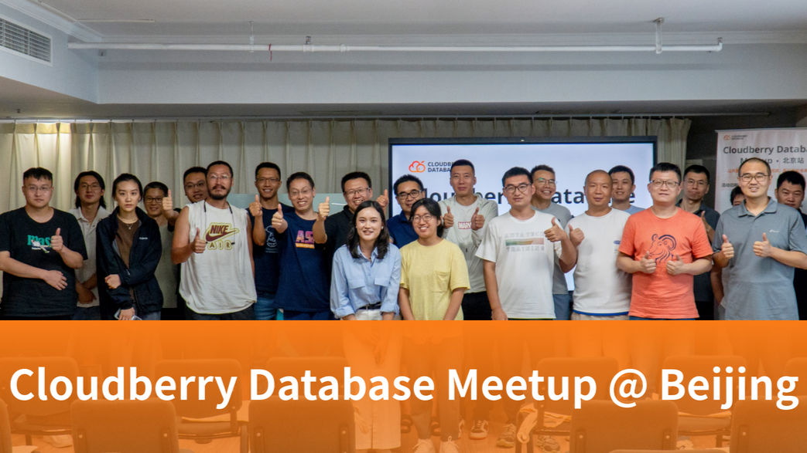
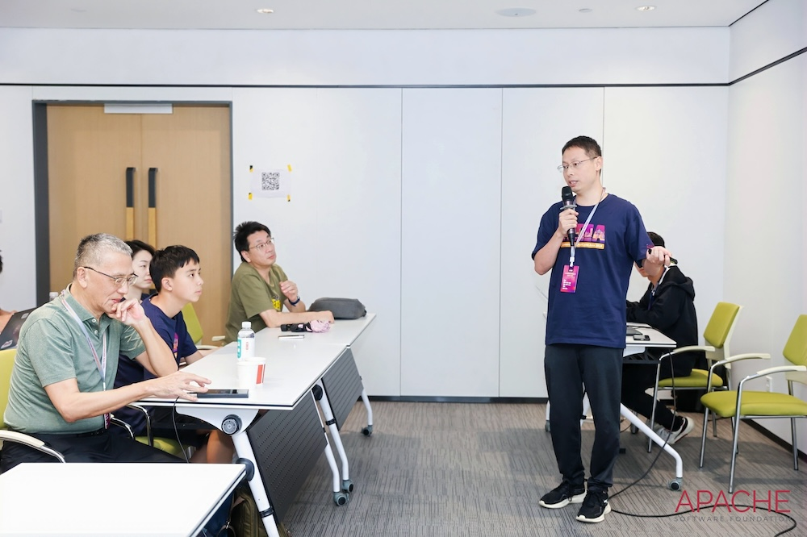
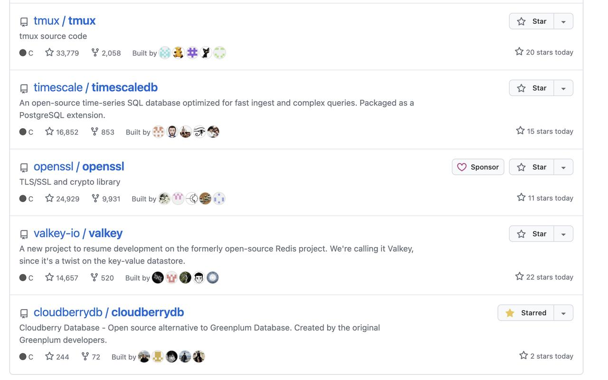

:::note

 ❤️ Cloudberry Database? Giving it a ⭐ on the [cloudberrydb/cloudberrydb](https://github.com/cloudberrydb/cloudberrydb) repo!

:::

## Pull Requests

- Use syscache lookup in ShouldUseReservedSegno [#541](https://github.com/cloudberrydb/cloudberrydb/pull/541) by @gongxun0928
- Update aocsam.c: fix safeFSWriteSize arg type [#540](https://github.com/cloudberrydb/cloudberrydb/pull/540) by @reshke
- [DNM]Enable the resgroup test cases [#539](https://github.com/cloudberrydb/cloudberrydb/pull/539) by @jiaqizho
- adjust test cases for the cloudberrydb binary swap test [#537](https://github.com/cloudberrydb/cloudberrydb/pull/537) by @congxuebin
- Add an option in psql to avoid encoding issues on some platforms [#535](https://github.com/cloudberrydb/cloudberrydb/pull/535) by @gfphoenix78
- Small README.md improvement. [#534](https://github.com/cloudberrydb/cloudberrydb/pull/534) by @reshke
- Support copy from directory table for entry distribution policy. [#533](https://github.com/cloudberrydb/cloudberrydb/pull/533) by @wenchaozhang-123
- Cherry-pick Resgroup V2 and toolkit from GPDB [#531](https://github.com/cloudberrydb/cloudberrydb/pull/531) by @jiaqizho
- Fix segfilecount of AO/AOCO when bulk insertion: COPY [#530](https://github.com/cloudberrydb/cloudberrydb/pull/530) by @avamingli
- [AQUMV]Allow to use normal materialized views to answer query. [#528](https://github.com/cloudberrydb/cloudberrydb/pull/528) by @avamingli
- Reimplement copy from directory table. [#527](https://github.com/cloudberrydb/cloudberrydb/pull/527) by @wenchaozhang-123
- [Answer Query Using Materialized Views] Refactor view query target list process. [#525](https://github.com/cloudberrydb/cloudberrydb/pull/525) by @avamingli
- Feature: Update orafce to 4.9 and enhance it [#524](https://github.com/cloudberrydb/cloudberrydb/pull/524) by @foreyes
- Doc: list more tools for Cloudberry Database [#523](https://github.com/cloudberrydb/cloudberrydb/pull/523) by @tuhaihe
- Fix copy to directory table always return 1. [#522](https://github.com/cloudberrydb/cloudberrydb/pull/522) by @wenchaozhang-123
- make gp_dqa test case stable [#521](https://github.com/cloudberrydb/cloudberrydb/pull/521) by @congxuebin
- Reduce flakiness in test fts_segment_reset [#518](https://github.com/cloudberrydb/cloudberrydb/pull/518) by @jiaqizho
- Add materialized view relative triggers case in SingleNode mode. [#517](https://github.com/cloudberrydb/cloudberrydb/pull/517) by @avamingli
- Ignore pg_upgrade to make CI happy. [#515](https://github.com/cloudberrydb/cloudberrydb/pull/515) by @avamingli
- Define EXT_OID_START to suggest oid range for extensions. [#514](https://github.com/cloudberrydb/cloudberrydb/pull/514) by @avamingli
- Add multiple operating system source code to compile CBDB [#512](https://github.com/cloudberrydb/cloudberrydb/pull/512) by @Zhangbaowen-Hashdata
- Fix compile error in c++20 [#510](https://github.com/cloudberrydb/cloudberrydb/pull/510) by @gfphoenix78
- Fix bsearch compare function in guc.c [#507](https://github.com/cloudberrydb/cloudberrydb/pull/507) by @gfphoenix78
- Refactor cbdb_log to use vfprintf [#506](https://github.com/cloudberrydb/cloudberrydb/pull/506) by @ruhuang2001
- [Unstable cases]Fix Some commands forgot to mark meta track. [#505](https://github.com/cloudberrydb/cloudberrydb/pull/505) by @avamingli
- Fix compile errors detected by gcc 12 [#503](https://github.com/cloudberrydb/cloudberrydb/pull/503) by @gfphoenix78
- Fix ignore of direct table test files. [#502](https://github.com/cloudberrydb/cloudberrydb/pull/502) by @avamingli
- Maintain materialized view data status. [#501](https://github.com/cloudberrydb/cloudberrydb/pull/501) by @avamingli
- Add LoongArch(loongarch64) support to s_lock.h [#500](https://github.com/cloudberrydb/cloudberrydb/pull/500) by @wangzw
- cherry-pick: Work around spurious compiler warning in inet operators [#499](https://github.com/cloudberrydb/cloudberrydb/pull/499) by @gfphoenix78
- Fix copy to replicated table display copy number is incorrect. [#498](https://github.com/cloudberrydb/cloudberrydb/pull/498) by @gfphoenix78
- Fix cbdb ci not running properly [#497](https://github.com/cloudberrydb/cloudberrydb/pull/497) by @Zhangbaowen-Hashdata
- Fix the correct size of memory block in bitmapinsert [#495](https://github.com/cloudberrydb/cloudberrydb/pull/495) by @gfphoenix78
- change AOCO_Compression test case to validate pg_relation_size and get_ao_compression_ratio within ±10% expected range  [#493](https://github.com/cloudberrydb/cloudberrydb/pull/493) by @congxuebin
- Resolve inconsistent result issue in gpdtm_plpgsql test case [#491](https://github.com/cloudberrydb/cloudberrydb/pull/491) by @congxuebin
- Fix gpinitsystem [#490](https://github.com/cloudberrydb/cloudberrydb/pull/490) by @fanfuxiaoran

## Issues

- Lack of track IO timing gpdb feature [#536](https://github.com/cloudberrydb/cloudberrydb/issues/536) by @reshke
- [Bug] AO tables didn't switch seg file when bulk insertion: COPY [#529](https://github.com/cloudberrydb/cloudberrydb/issues/529) by @avamingli
- [Feature] Give a easy start-guide for a new contributor, such as script(singe node deploy) [#519](https://github.com/cloudberrydb/cloudberrydb/issues/519) by @lilei1128
- [Bug]  `configure`  development script generates an 'sh' shell error due to an initialized variable (ac_cv_func_fseeko) [#516](https://github.com/cloudberrydb/cloudberrydb/issues/516) by @edespino
- [Bug] starting new instance failed in certain case [#511](https://github.com/cloudberrydb/cloudberrydb/issues/511) by @congxuebin
- [Bug] [oe2309] unexpected execution of aborted due to compilation errors [#509](https://github.com/cloudberrydb/cloudberrydb/issues/509) by @congxuebin
- [Bug] [oe2309] server terminated abnormally when call plpython procedure [#508](https://github.com/cloudberrydb/cloudberrydb/issues/508) by @congxuebin
- [Bug] Some commands forgot to mark meta track calls unstable failed cases. [#504](https://github.com/cloudberrydb/cloudberrydb/issues/504) by @avamingli
- [Bug] Build failed with gcc 12 on openEuler 24.03 [#494](https://github.com/cloudberrydb/cloudberrydb/issues/494) by @wangzw
- [Bug] perl ssl test failed against centos 9 operating system [#492](https://github.com/cloudberrydb/cloudberrydb/issues/492) by @congxuebin

## Bootcamp for Cloudberry Database

In July, the Bootcamp program was updated with lots of improvements, and now supports the latest Cloudberry Database release v1.5.4.

Welcome to try it out:  [https://github.com/cloudberrydb/bootcamp](https://github.com/cloudberrydb/bootcamp).

Thanks to @edespino, @tuhaihe, and @shawn0915 for making their contributions this month!

## Events

### Cloudberry Database Meetup @ Beijing

🍺 Our first-ever in-person Cloudberry Database Meetup in Beijing 2024 was successfully organized. Welcome to take a look at our review blog for details:  [https://www.linkedin.com/pulse/first-ever-in-person-cloudberry-database-meetup-beijing-2024-h3ssc](https://www.linkedin.com/pulse/first-ever-in-person-cloudberry-database-meetup-beijing-2024-h3ssc).

🌍 Looking forward to more Cloudberry Meetups in more cities around the world!

### CommunityOverCode Asia 2024

CommunityOverCode (formerly known as ApacheCon) is the official global conference series of The Apache Software Foundation (ASF). This year,  [CommunityOverCode Asia 2024](https://asia.communityovercode.org/index.html)  was held in Hangzhou from July 26 to 28，2024.

Dianjin Wang [@tuhaihe](https://github.com/tuhaihe), our community manager, took care of the OLAP & Analytics track this year and also gave a talk on the story of Cloudberry Database open source, sharing the lessons learned in its open-source incubation from scratch.

## Listed on GitHub Trending - C

🎉 Cloudberry Database was listed again on the GitHub trending list for a few days this month!

## More

-   Hosting Cloudberry Database under the third-party Foundations
    
    Since last month, we have been contacting original Greenplum vendors and contribution teams. Some of them have agreed to take the Cloudberry Database to the Apache Software Foundation incubator together. The incubation proposal is still in progress. Looking forward to sharing more in the following weeks.
    
-   New Release
    
    @edespino is working on the new release, let's wait for it! Coming soon.

## Join us

The Cloudberry Database community welcomes everyone to contribute, regardless of their level of experience. We encourage all types of contributions, no matter how small. Our  [contribution guide](https://cloudberrydb.org/contribute)  is available to help you get started with the process.

In addition, we offer various channels for community members to discuss, seek help, provide feedback, and chat. You can find  [support](https://cloudberrydb.org/support)  here. Let us know if you have any questions or feedback - we're always here to help!

Join us and be part of our community!