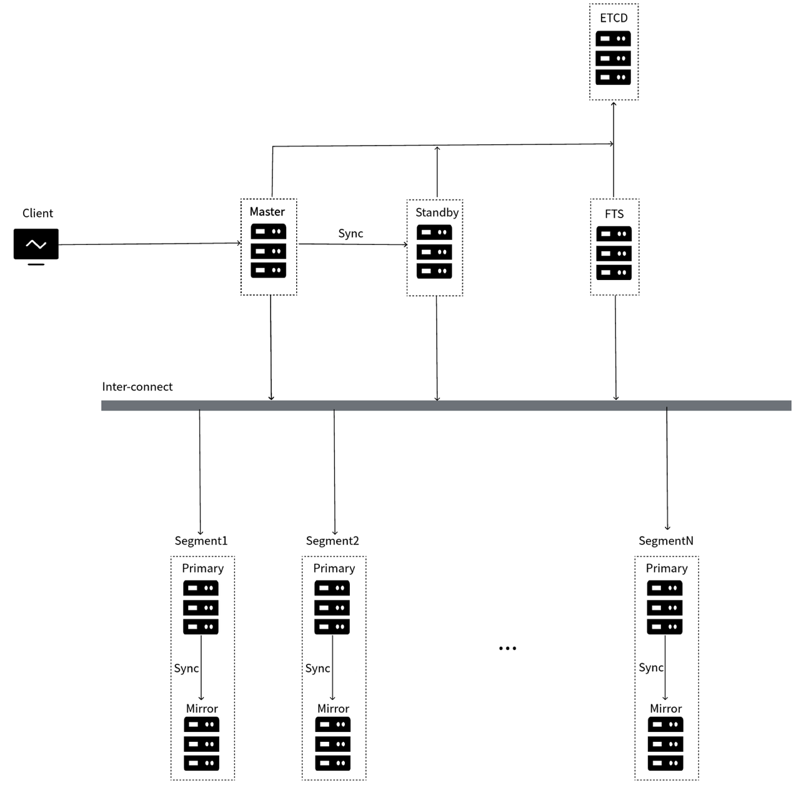

# Local Deployment Architectures

Before reading this document, it is recommended to understand the architecture of Cloudberry Database by referring to [Cloudberry Database Architecture](./cbdb-architecture.md).

This document introduces two architecture options for deploying the Cloudberry Database on your local machine: the "active-standby architecture" and the "automatic high-availability architecture". The main difference between the two is whether or not manual operation and maintenance is required to recover the database from master/standby node failures. Before deploying Cloudberry Database on your local machine, you need to understand these 2 architectures and choose according to your actual needs.

| Deployment architecture | Benefits | Costs and risks |
| ------------------------ | ---- | ---- |
| Active-standby architecture (default) | <ul><li>Similar to the traditional Greenplum architecture. Well compatible with Greenplum tool ecosystem.</li><li>No need to deploy high-availability components separately, and its resource requirements are slightly lower.</li></ul> | <ul><li>If the master node fails, the database cannot automatically recover from the failure, and metadata cannot be updated in time. </li><li>If the master/standby node fails, manual intervention is required for recovery, which will result in manual maintenance costs. </li></ul> |
| Automatic high-availability architecture | If the master/standby node fails:<ul><li>The system automatically switches nodes, with high reliability.</li><li>No manual intervention is required, saving manual maintenance costs.</li></ul> | Needs additional deployment of high-availability components (fault detection and recovery nodes, and ETCD clusters). |

:::info Glossary

- FTS (Fault Tolerance Service) refers to fault recovery nodes. FTS is a high-availability service of Cloudberry Database.
- ETCD: Used to store the cluster topology information and cluster state metadata of Cloudberry Database.
- MPP (Massively Parallel Processing) refers to the method of processing data on many processors simultaneously in a coordinated way.

:::

## Active-standby architecture (default)

The active-standby architecture is the default deployment architecture of Cloudberry Database on physical machines, which is compatible with Greenplum Database architecture and tool ecosystem. With this deployment architecture, Cloudberry Database behaves the same as traditional Greenplum Database.

In this deployment architecture, you do not need to deploy the FTS and ETCD services. However, in this architecture, the master and standby nodes do not support automatic failure recovery, and you need to manually switch between master and standby nodes to recover from failures. The failure recovery might take a long time and the operation is complicated.

The architecture is shown in the figure below:

## Automatic high-availability architecture

In the automatic high-availability architecture, if the master or standby node fails, the database automatically switches between the master and standby nodes. This avoids time-consuming and complicated manual operations and improves availability and reliability.

With the automatic high-availability architecture, you need to deploy additional FTS high-availability nodes and ETCD service components in the cluster:

- FTS high-availability service: Deployed independently of the master node. The FTS cluster has only one working node, and the rest nodes are hot standby nodes. When the FTS primary node is abnormal, the service can automatically switch to the hot standby node. This mechanism ensures that any node failure or exception will not affect the high availability of FTS and database operation.
- ETCD service: Used to store and maintain database cluster state metadata. ETCD cluster guarantees high availability by its own mechanism, and any node failure or exception will not affect the operation of ETCD and database.

You can either use separate physical machine resources to deploy the FTS and ETCD clusters or deploy these clusters in a hybrid manner on the same physical machine as the data nodes.

The architecture is shown in the figure below:

:::info Implementation details

The automatic failover of the master node is implemented based on the WAL log synchronization mechanism between the master/standby nodes. When the database log synchronization is abnormal, the master node does not support automatic failover recovery. Once the master/standby log is successfully synchronized, the cluster log synchronization status is updated in the ETCD service, to indicate whether the current master node meets the requirements for automatic failover recovery.

- If the master node goes down, the standby node will be automatically switched to as the new master node only when the log status saved in ETCD is detected as synchronized.
- When the master node is down, if the log status saved in ETCD is detected as unsynchronized, the standby node will not be automatically promoted to the new master node. In this case, the automatic switching between the master/standby nodes might have unpredictable impacts on the database. Therefore, user intervention is still required to confirm the issue and then manually switch node to recover the database system.

:::