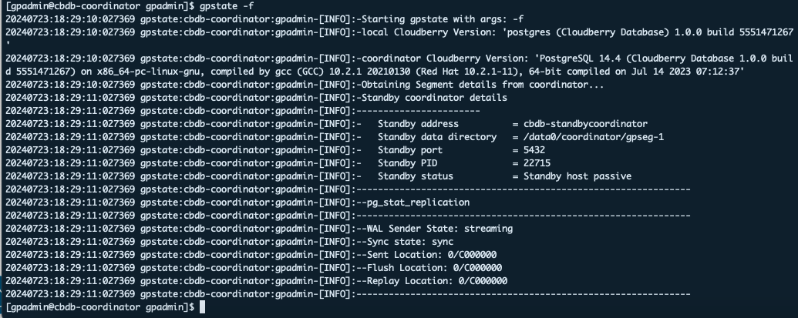
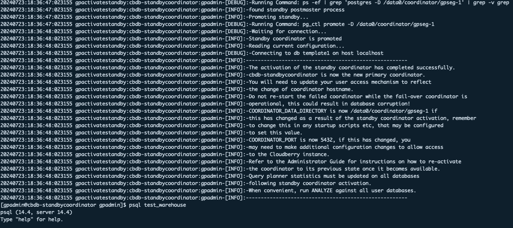

# Enable Coordinator Mirroring for Cloudberry Database

Cloudberry Database provides a series of high-availability features to make sure your database system can tolerate unexpected incidents such as a hardware platform failure and can be quickly recovered from such incidents.

This topic describes how to configure coordinator mirroring to ensure a smooth coordinator node failover.

## Overview of coordinator mirroring

In addition to the primary working coordinator node, you can include a standby coordinator in your CBDB cluster, which can take the system over when the primary host is down.

The primary and standby coordinators should be deployed on different hosts so that the cluster can tolerate a single-host failure. Clients connect to the primary coordinator and queries can be run only on the primary coordinator. The standby coordinator is kept up to date with the primary coordinator using Write-Ahead Logging (WAL)-based streaming replication.

If the coordinator fails, the administrator needs to run the `gpactivatestandby` utility to have the standby coordinator take over as the new primary coordinator. You can configure a virtual IP address for the coordinator and standby so that client programs do not have to switch to a different network address when the current coordinator changes. If the coordinator host fails, the virtual IP address can be swapped to the actual acting coordinator.

## Configure coordinator mirroring

Take the following steps to enable and activate coordinator mirroring for your CBDB cluster:

### Prerequisites

Make sure that you have already configured a standby coordinator on a different host from where the primary coordinator is running. Specifically, ensure that the following is properly configured on the standby coordinator host:

-   `gpadmin` system user is created
-   CBDB rpm package is installed
-   Environmental variables are set
-   SSH keys are exchanged
-   Data directories and tablespace directories, if needed, are created

:::note

If you follow the steps described in the [Prepare to Deploy](https://cloudberrydb.org/docs/cbdb-op-prepare-to-deploy) and [Deploy Cloudberry Database Manually Using RPM Package](https://cloudberrydb.org/docs/cbdb-op-deploy-guide) topics to deploy the cluster, a host for the standby coordinator ( `cbdb-standbycoordinator`) is already configured in the cluster.

:::

### Step 1. Enable the standby coordinator

You need to first enable the standby coordinator using the `gpinitstandby` utility:

1. Run the `gpinitstandby` utility on the currently active primary coordinator (`cbdb-coordinator`) host to add a standby coordinator host to your CBDB cluster. For example:

    ```
    $ gpinitstandby -s cbdb-standbycoordinator
    ```

    The `-s` option specifies the standby coordinator hostname.

    You will be prompted with the following message when the initialization is completed: `-Successfully created standby coordinator on cbdb-coordinator`.

2. You can run the `gpstate` utility with the `-f` option to display details of the standby coordinator host.

    ```
    $ gpstate -f
    ```

    The standby coordinator status should be `passive`, and the WAL sender state should be `streaming`, as demonstrated below:

    

### Step 2. Activate the standby coordinator

If the primary coordinator fails, the CBDB cluster is not accessible and WAL replication stops. You can use `gpactivatestandby` to activate the standby coordinator. Upon activation of the standby coordinator, CBDB reconstructs the coordinator host state at the time of the last successfully committed transaction.

To activate the standby coordinator:

1. Run the `gpactivatestandby` utility from the standby coordinator host you are activating. For example:

    ```
    $ export PGPORT=5432
    $ gpactivatestandby -d /data0/coordinator/gpseg-1
    ```

    Where `-d` specifies the data directory of the coordinator host you are activating.

    :::note

    - Before running `gpactivatestandby`, be sure to run `gpstate -f` to confirm that the standby coordinator is synchronized with the current coordinator node. If synchronized, the final line of the `gpstate -f` output will look similar to this: `20230607:06:50:06:004205 gpstate:test1-m:gpadmin-[INFO]:--Sync state: sync`
    
    - It might take a moment for the activation to be completed. Wait until you are prompted to continue the process and enter `Y` in your terminal to confirm.

    :::

    After you activate the standby, it becomes the active or primary coordinator for your CBDB cluster. You can access the CBDB cluster by connecting to the standby coordinator.

    

2. After the utility is completed, you can run `gpstate` with the `-b` option to display a summary of the system status:

    ```
    $ gpstate -b
    ```

    The coordinator status should be `Active`. When a standby coordinator is not configured, the command displays `No coordinator standby configured` for the standby coordinator status. If you configured a new standby coordinator, its status is `Passive`.

### Step 3. Restore coordinator mirroring after a recovery

After you activate a standby coordinator for recovery, the standby coordinator becomes the primary coordinator. You can continue running that instance as the primary coordinator if it has the same capabilities and dependability as the original coordinator host.

You must initialize a new standby coordinator to continue providing coordinator mirroring unless you have already done so while activating the prior standby coordinator.

Take the steps below to configure the failed primary coordinator to become a standby coordinator:

1. Ensure the original coordinator host is in dependable running condition.

2. On the original primary coordinator host, move or remove the data directory, `gpseg-1`. This example moves the directory to `backup_gpseg-1`:

    ```
    $ mv /data0/coordinator/gpseg-1 /data0/coordinator/backup_gpseg-1
    ```

    You can remove the backup directory once the standby is successfully configured.

3. Initialize a standby coordinator on the original coordinator host. For example, run this command from the current coordinator host, `cbdb-standbycoordinator`:

    ```
    $ gpinitstandby -s cbdb-coordinator
    ```

4. After the initialization is completed, check the status of the standby coordinator `cbdb-coordinator`. Run `gpstate` with the `-f` option to check the standby coordinator status:

    ```
    $ gpstate -f
    ```

    The standby coordinator status should be `passive`, and the WAL sender state should be `streaming`.