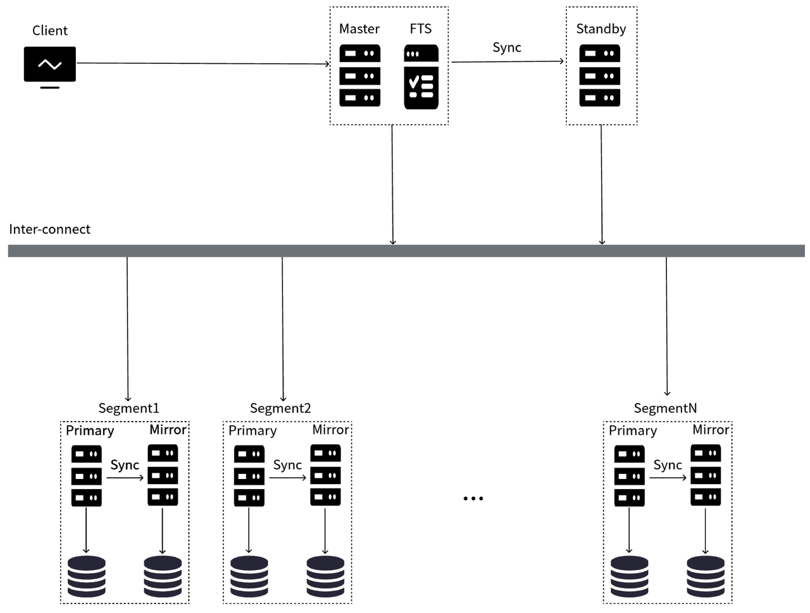

# 物理机部署架构

本文介绍 Cloudberry Database 所支持的两种物理机部署架构，即“手动高可用部署架构”和“自动高可用部署架构”。两种架构的主要差异在于 Master/ Standby 节点故障恢复是否需要人工运维。在物理机上部署前，你需要了解这两种架构，并根据实际需要进行选择。

在阅读本文前，你需要先阅读 Cloudberry Database 架构介绍，对 Cloudberry Database 的架构有所了解。

| 部署架构                 | 收益或优势 | 成本或风险 |
| ------------------------ | ---- | ---- |
| 手动高可用部署架构（默认模式） | <ul><li>与传统的 Greenplum 架构类似，能较好利用 Greenplum 的生态工具。</li><li>无需单独部署高可用组件，资源要求稍低。</li></ul>     |  <ul><li>Master 节点宕机后，整个数据库的高可用功能不可用，元数据信息得不到及时更新。</li><li>Master / Standby 节点发生故障后，需要手动介入恢复，可能需要一定的人工运维成本。</li></ul>    |
| 自动高可用部署架构         |  Master / Standby 节点发生故障后：<ul><li>系统自动切换节点，可靠性高。</li><li>无需用户手动介入，节省手动运维成本。</li></ul>    |  <ul><li>需要额外部署 Master / Standby 高可用相关组件（故障检测恢复节点和 ETCD 集群）</li><li>在与 Greenplum 生态兼容方面，稍逊于手动高可用部署架构。</li></ul>    |

:::info 名词解释

- FTS，全称为 Fault Tolerance Service，即故障恢复节点，为 Cloudberry Database 的高可用服务。
- ETCD：Cloudberry Database 的元数据服务。
- MPP，即 Massively Parallel Processing，表示数据库大规模并行处理方式。

:::

## 手动高可用部署架构（默认）

手动高可用部署架构是 Cloudberry Database 在物理机上的默认部署架构，可以兼容 Greenplum 数据库架构和工具生态。使用该部署架构，Cloudberry Database 的行为与传统 Greenplum 数据库行为保持一致。

在该部署架构下，你无需额外部署 FTS 节点以及 ETCD 组件服务。但相应地，Master 和 Standby 节点不支持自动故障恢复功能，你需要手动切换来恢复故障，故障恢复可能时间长且操作复杂。

架构如下图所示：

## 自动高可用部署架构

采用自动高可用部署架构，在数据库 Master/Standby 节点发生故障时，系统自动切换节点，无需耗时且复杂的人工运维操作，提升了系统的可用性和可靠性。

采用自动高可用部署架构，你需要在集群中额外独立部署 FTS 高可用节点以及 ETCD 元数据服务组件：

- FTS 高可用服务：独立于 Master 节点，通过集群方式部署。FTS 集群只有一个工作节点，其余节点均为热备节点。当 FTS 主节点出现异常后服务可实现自动切换到热备节点，该机制用于保障任何数据库节点宕机或异常不会影响 FTS 高可用及数据库功能正常运行。
- ETCD 服务组件：用于统一存放和维护数据库集群状态元数据信息，ETCD 集群由服务自身机制保障高可用性，任意节点宕机或异常都不会影响 ETCD 服务及数据库功能正常运行。

你可以使用单独的物理机资源来部署 FTS 和 ETCD 集群，也可以将这些集群以混合方式部署在数据节点的物理机资源上。

架构如下图所示：

:::info 原理说明

Master 节点故障自动切换功能的实现基于 Master/Standby 节点间 WAL 日志同步机制，在数据库日志同步异常的状态下 Master 节点不支持自动切换恢复。Master/Standby 日志同步正常完成后会在 ETCD 服务中更新集群日志同步状态，用于标识当前 Master 节点是否支持自动切换恢复条件。

- 在 Master 节点宕机时，仅检测到 ETCD 中保存的日志状态为同步，Standby 节点才会被自动提升为新的Master 节点。
- 在 Master 节点宕机时，如果检测到 ETCD 中保存的日志状态为不同步，Standby 节点不会被自动提升为新的 Master 节点。在这种情况下 Master/Standby 节点自动切换会对数据库造成不可预估的影响，因此在这种场景下仍需要用户介入确认问题后，再手动方式切换恢复数据库系统。

:::