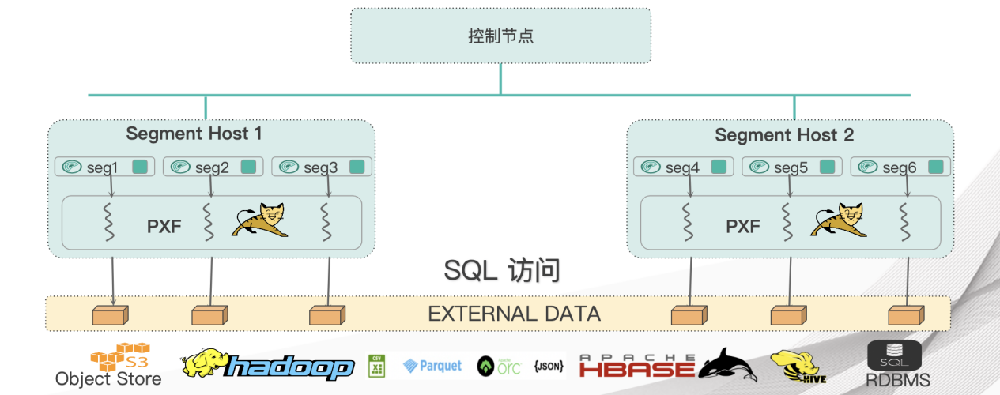
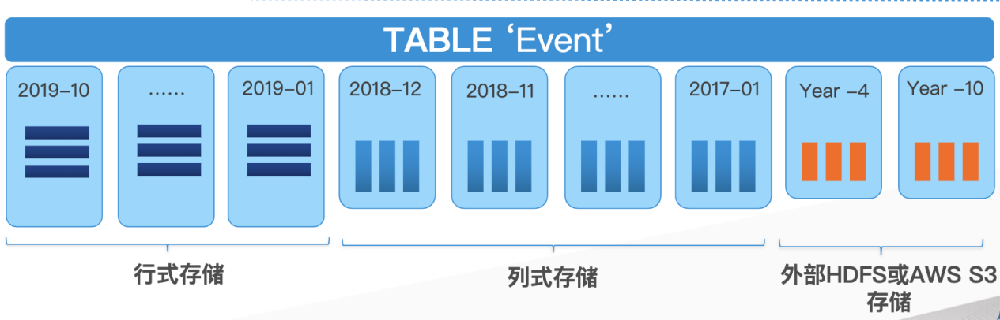
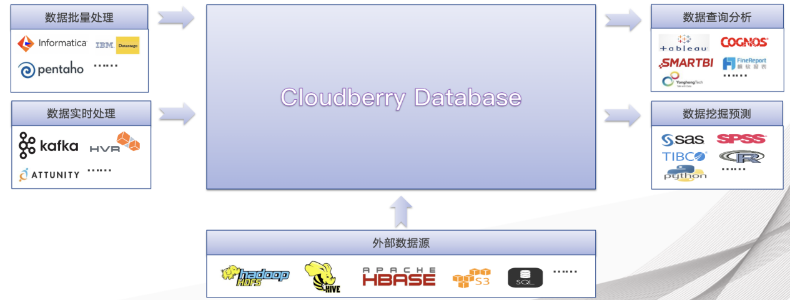

# Cloudberry Database 介绍

Cloudberry Database 基于最新的 PostgreSQL14.4 内核（2022 年中发布），是当前最先进的成熟开源 MPP 数据库之一，具备高并发、高可用等多种特性，可以对复杂任务进行快速高效计算，以满足海量数据管理和计算的需求，目前在多个领域都有着广泛应用。

- 性能优秀： Cloudberry 在数据存储、高并发、高可用、线性扩展、反应速度、易用性和性价比等方面显著的优势。进入大数据时代以后，Cloudberry 在处理 TB 级别数据量上性能优秀，单机性能明显优于 Hadoop。
- 语法兼容性强：在功能和语法上，远比 Hadoop 上的 SQL 引擎 Hive 易用，普通用户更加容易上手。
- 工具完善： Cloudberry 有着完善的工具体系，用户无需投入太多时间和精力进行工具改造，因此适合作为大型数据仓库的解决方案。
- 部署灵活： Cloudberry 支持灵活的部署方式，包括传统的硬件部署，支持多云和跨云部署。
- 对不同数据类型、数据格式、存储介质都提供完善的支持。多层次的灵活性也让 Cloudberry Database可以更好地满足用户多方位的需求。

本手册重点介绍 Cloudberry Database 的产品架构以及内部模块的实现机制，以及对于用户的意义。

## 产品架构

在大多数情况下，Cloudberry Database 在 SQL 支持、功能、配置选项和最终用户功能方面与 PostgreSQL 非常相似。数据库用户与 Cloudberry Database 数据库的交互体验，非常接近与单机 PostgreSQL 进行交互。

Cloudberry Database 采用 MPP 架构技术，通过在多个服务器或主机之间分配数据和处理工作负载来存储和处理大量数据。

MPP 也称为无共享体系架构，是指具有多台主机的系统，这些主机协作执行一项操作。每台主机都有自己的处理器、内存、磁盘、网络资源和操作系统。Cloudberry Database使用这种高性能的系统架构来分配海量数据的负载，并且可以并行使用系统的所有资源来处理查询。

从用户角度来看，Cloudberry Database 是一个完备的关系数据库管理系统 (RDBMS)。从物理层面来看，它内含多个 PostgreSQL 实例。为了实现多个独立 PostgreSQL 实例的分工和合作，Cloudberry Database 在不同层面对数据存储、计算、通信和管理进行了分布式集群化处理。Cloudberry Database 虽然是一个集群，然而对用户而言，它封装了所有分布式的细节，为用户提供了单个逻辑数据库。这种封装极大地解放了开发人员和运维人员的工作。

Cloudberry Database 架构图如下所示：

HashData 由如下组件构成：

- **控制节点 (Master)** 是 Cloudberry Database 数据库系统的入口，它接受客户端连接和 SQL 查询，并将工作分配给数据节点实例。用户与 Cloudberry Database 进行交互，使用客户端程序（例如 psql）或应用程序编程接口（API）（例如 JDBC、ODBC 或 libpq PostgreSQL C API）连接到控制节点。
    - 控制节点是全局系统目录所在的位置，全局系统目录是一组系统表，其中包含有关 Cloudberry Database 数据库系统本身的元数据。
    - 控制节点不包含任何用户数据，数据只保存在数据节点实例上。
    - 控制节点对客户端连接进行身份验证，处理传入的 SQL 命令，在数据节点之间分配工作负载，协调每个数据节点返回的结果，并将最终结果呈现给客户端程序。
    - Cloudberry Database 使用预写日志记录（WAL）进行控制节点/Standby 镜像。在基于 WAL 的日志记录中，所有修改都将在写入磁盘之前先写日志，以确保任何进程内操作的数据完整性。

- **数据节点 (Segment)** 实例是独立的 Postgres 进程，每个数据节点存储一部分数据并执行相应部分查询。当用户通过控制节点连接到数据库并提交查询请求时，会在每个数据节点创建进程来处理查询。用户定义的表及其索引分布在 Cloudberry Database 中的所有可用数据节点中，每个数据节点都包含数据的不同部分，不同部分数据处理的进程在相应的数据节点中运行。用户通过控制节点与数据节点进行交互，数据节点在称为数据节点主机的服务器上运行。

    数据节点主机通常执行 2 到 8 个数据节点，具体取决于处理器、内存、存储、网络接口和工作负载。数据节点主机的需要平衡配置，因为 Cloudberry Database获得最佳性能的关键是将数据和工作负载平均分配到数据节点中，以便所有数据节点同时开始处理一项任务并同时完成工作。

- **内部互联 (Interconnect)** 是 Cloudberry Database 系统架构中的网络层。内部互联是指控制节点、数据节点通信所依赖的网络基础架构，使用标准的以太网交换结构。

    出于性能原因，建议使用 10 GB 或更快的网络。默认情况下，内部互联模块使用带有流控制(UDPIFC) 的 UDP 协议来实现通信，以通过网络发送消息。Cloudberry Database 执行的数据包验证超出了 UDP 所提供的范围，这意味着可靠性等同于使用 TCP 协议，并且性能和可伸缩性超过了 TCP 协议。 如果将内部互联改为使用 TCP 协议，则 Cloudberry Database 的可伸缩性限制为 1000 个数据节点。使用 UDPIFC 作为默认协议时，此限制不适用。

- Cloudberry Database 使用多版本控制 (Multiversion Concurrency Control/MVCC) 保证数据一致性。这意味着在查询数据库时，每个事务看到的只是数据的快照，其确保当前的事务不会看到其他事务在相同记录上的修改。据此为数据库的每个事务提供事务隔离。

    MVCC 以避免给数据库事务显式锁定的方式，最大化减少锁争用以确保多用户环境下的性能。在并发控制方面，使用 MVCC 而不是使用锁机制的最大优势是，MVCC 对查询（读）的锁与写的锁不存在冲突，并且读与写之间从不互相阻塞。

## 数据加载

Cloudberry Database 通过外部表技术支持大批量并行、持续化的数据加载，能够支持GBK/UTF8等字符集间的自动转换。由于基于 MPP 架构，Scatter-Gather StreamingTM 技术提供性能线性扩张。能够支持外部文件服务器、Hive、Hbase、HDFS、S3 多种存储介质以及 CSV、Text、JSON、ORC、Parquet等多种文件格式，支持 Zip 等压缩数据文件加载，被 DataStage、Informatica、Kettle 等多款 ETL 工具集成。

Cloudberry Database 同时支持流式数据加载，针对订阅的 Kafka Topic，根据设置的Task最大值，启动多个 Task 并行读取 Partition 数据，读取后将记录缓存，到一定时间或记录数，通过 gpfdist 加载到 Cloudberry Database 保证数据不重、不丢，用于流数据采集、实时分析场景。支持达到每分钟几千万的数据加载吞吐量。

PXF 是 Cloudberry Database 内置组件，支持将外部数据源映射到 Cloudberry Database 外部表，实现 Data Fabric 架构。并基于 MPP 引擎实现并行、高速的数据访问，支持混合数据生态管理和访问。

## 数据存储和安全

Cloudberry Database 计算的并行化基于数据在存储层的均匀分布，数据均匀分布是并行处理的关键，Cloudberry Database 数据库提供了 Hash 和 Random 两种方式存储层分布数据，保证：数据均匀分布在每一块磁盘上面发挥每一块磁盘性能，根本上解决I/O瓶颈Cloudberry Database 提供了更灵活的分布方式。

针对小表可以采用Replication Table 支持用户在创建表示指定自定义Hash算法，灵活控制数据分布。同时支持行式存储和列式存储。

- 行式存储：更新速度快，大多数字段频繁查询，随机行访问较多。
- 列式存储：少数字段查询，大幅节省 I/O 操作，大数据量频繁访问。

Cloudberry 可以按照应用类型设计存储模式，最细粒度到分区，实现一张表多种存储模式，达到最优化访问性能。查询执行时，Cloudberry Database 优化器会根据用户使用的存储形态根据统计信息生成对应最优的查询计划，而不需要用户干预。

数据压缩提高数据处理性能，压缩比依赖于压缩算法和数据内容，针对移动信令、话单、点击流数据压缩比可以达到 20 倍以上。无论哪种存储模式，均支持压缩，一张表的不同列支持不同的压缩算法。Cloudberry Database 提供多种压缩算法：

- Zlib 1-9，压缩比高，占用 CPU 资源较多，适用于 CPU 计算能力较强的场景。
- Zstandard 1~19，实现 CPU 与压缩比的平衡。

同时，数据安全也非常重要，Cloudberry 支持多数据库，数据库之间数据不共享，跨数据库访问可通过 DBLink。数据库内部数据的逻辑组织，包括多累数据对象，如：表、视图、索引、函数等，数据访问可以跨 Schema。

在存储安全性上，支持不同存储模式，支持数据冗余，支持数据加密 AES 128、192，256 DES等以及国密加密。支持密文认证，支持各类加密算法 SCRAM-SHA-256、MD5、LDAP、RADIUS 等。针对不同的用户，在不同级别的对象（如：Schema、表、行、列、视图、函数等）上进行多种类型的权限设定，可以设定的权限包括：SELECT、UPDATE、执行权、所有权等等。

## 数据分析

Cloudberry Database 内核内置了强大的并行优化器和执行器，能够兼容 PostgreSQL 生态，能够支持数据分区裁剪、索引（BTree，Bitmap，Hash，Brin，GIN等），JIT（表达式即时编译处理）等技术。

除此之外，Cloudberry Database 集成了大量丰富的分析组件：

- 机器学习组件。MADlib on Cloudberry Database：全部 SQL 驱动，算法 + 算力 + 数据。
- PL language。开发人员可以使用 R、Python、Perl、Java、PostgreSQL 等语言编写用户自定义函数。
- 基于 MPP 引擎，实现高性能、并行计算，与 SQL 无缝集成，针对 SQL 执行结果计算、分析。
- PostGIS。基于PostGIS 2.X 进行了企业级改进，支持 Cloudberry Database MPP 架构，集成对象存储，支持大容量对象从 OSS 加载入库，支持所有的空间数据类型（geometry、geography 、Raster等），支持时空索引，支持复杂的空间和地理位置计算，球体长度计算 空间聚集函数（包含、覆盖、相交等）。
- Cloudberry Database Text 组件。支持利用 ElasticSearch 加速文件检索能力，相比传统的 GIN 数据文本查询性能达到数量级的明显提升，并且支持多种分词，自然语言处理，查询结果渲染等能力。

## 灵活的工作负载管理

- 连接池 PGBouncer（Connection 级，在连接级别支持 Cloudberry 集群高并发）：数据库端统一管理会话，控制同时有多少用户可以接入，避免频繁创建销毁服务进程，占用内存小，支持高并发，使用 libevent 进行 Socket 通信，效率更高。
- 资源组 Resource Group（Session 级，在会话级别量化控制 Cloudberry 集群资源）：梳理典型工作负载，分析负载 CPU、内存、并发度需求，基于对工作负载的分析设置 Resource Group，监控 GP 运行，动态调整 RS，利用规则清理空闲会话。
- 动态分配资源组（Query 级，在 SQL 级别动态调整 CBDB 集群资源）：在 SQL 语句执行前或执行过程中，动态实现资源的灵活、动态调配，用于优待特定查询，从而缩短其运行时间。

## 高度兼容第三方产品

Cloudberry Database 数据库与 BI 工具、挖掘预测工具、ETL 工具、J2EE/.NET 应用程序、以及其他数据源/计算引擎均有良好的连通性。

## 跨平台和国产化支持

Cloudberry Database 支持多种包括 X86、ARM、飞腾、鲲鹏、海光等系统硬件架构，以及 CentOS、Ubuntu、Kylin、BC-Linux 等多种操作系统环境。

