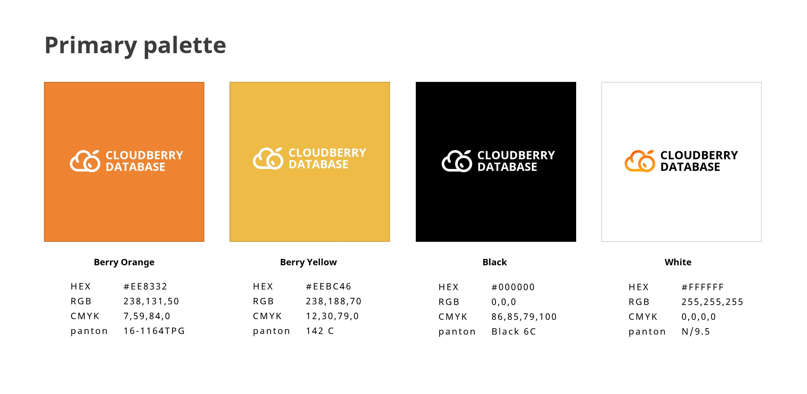
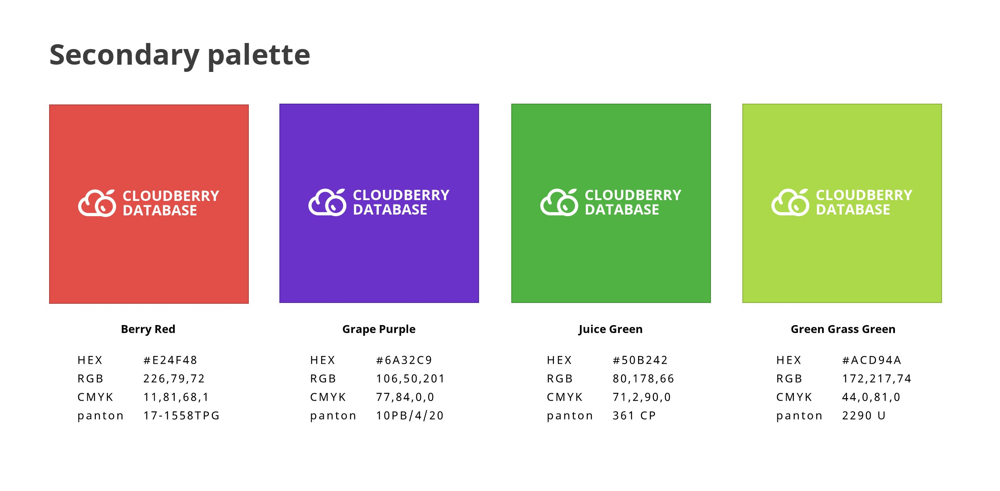
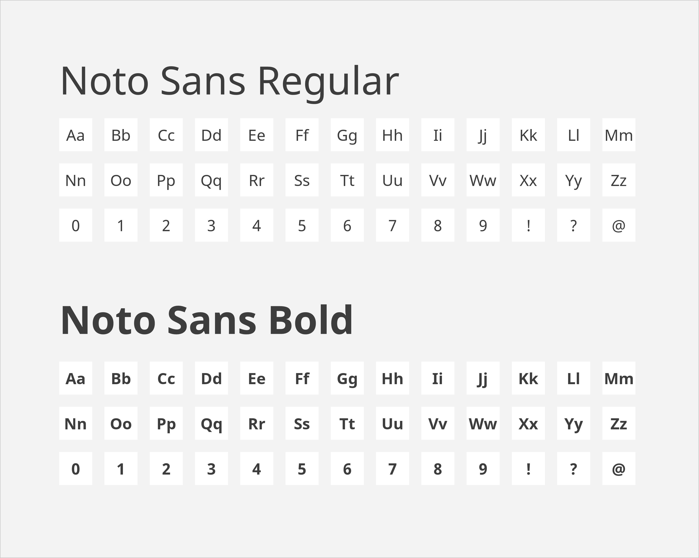

# Brand Guidelines

Welcome to the Brand Guide for Cloudberry Database!

We're excited to share with you the insights and inspiration behind
our project's visual identity. This guide is designed to walk you
through the key elements of our logo, its usage, and its significance
in reflecting the essence of our ambitious project. So, get ready to
dive deep into the world of Cloudberry Database.

## Cloudberry Database logo

:::info Download

You can download all the logo files from our
[artwork@GitHub](https://github.com/cloudberrydb/artwork), including
different versions, and formats.

:::

Our project's formal name is "Cloudberry Database". If you mention it,
please use the full name if you can.

:::caution

In some situations, people probably use "CBDB", "CloudberryDB" for
short. We don't encourage this way but recognize it can be beneficial
to communicate with others efficiently.

:::

### Logo mark

Our logo mark is a combination of "cloud" and "cloudberry".

### Logo versions 

We also offer various logo versions that are commonly used in many
marketing scenarios. These options are available for your use as
deemed appropriate for the specific situation.

|  |  |
|-------------------------------------------------------------------------|--------------------------------------------------------------------------|
| *Black logo mark*                                                       | *Black full logo*                                                        |

### Clear Space

The Cloudberry Database logo requires ample clear space for optimal
clarity. This area should remain free from any visual components at
all times.

### Backgrounds

Use the Cloudberry Database logos with the following backgrounds to
have a better image.

|  |        |
|-----------------------------------------------------------------------|-----------------------------------------------------------------------------|
|   |  |

### Colors

#### Primary palette

Our Cloudberry Database's primary brand colors are Berry Orange, Berry
Yellow, Back, and White.

#### Secondary palette

The secondary palette features a diverse set of supporting colors that
helps provide additional balance and range. Secondary colors should be
used sparingly throughout the system in order to maintain optimal
effect and a consistent look and feel.

### What to avoid

|  **Don't alter, crop, skew, outline, distort or recreate the logo** |  **Don’t use the full-color logo on an unapproved background color or low-contrast photo** |  **Don’t display the Cloudberry Database name without the logo mark** |
|----------------------------------------------------------------------------------------------------------------------------|-----------------------------------------------------------------------------------------------------------------------------------------------------|-------------------------------------------------------------------------------------------------------------------------------|
|   **Don’t use the full-color logo on the core color backgrounds**  |  **Don’t change the orientation of the logo mark**                                          |   **Don’t change the logo color**                                     |

## Typography

### Primary typeface: Noto Sans 

Noto Sans is an unmodulated (“sans serif”) design for texts in the
Latin, Cyrillic, and Greek scripts, which is also suitable as the
complementary choice for other script-specific Noto Sans fonts. It has
italic styles, multiple weights and widths, and 3,741 glyphs. Noto
Sans is licensed under the Open Font License which allows us to use it
in products & projects - print or digital, commercial or otherwise.

Noto Sans should be the primary font choice for all Cloudberry
Database materials.

### Download

You can download Noto Sans for free from [Google
Fonts](https://fonts.google.com/noto/specimen/Noto+Sans).

If you have a PC, check out the details on how to install a font
[here](https://support.microsoft.com/en-us/help/314960/how-to-install-or-remove-a-font-in-windows).

If you have a Mac, see how to install the font
[here](https://support.apple.com/en-us/HT201749).

## Questions

Feel free to email questions to info@cloudberrydb.org. It helps if you
provide a sample of your desired usage, enabling us to tailor our
feedback accordingly. Although we strive to respond as quickly as
possible, kindly allow up to two weeks for a response (please note
that no response doesn't mean approval).
