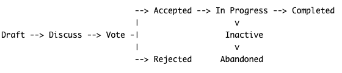

# Cloudberry Database Proposal Guide

This page describes a `Cloudberry Database Proposal(CP)` process for
proposing major changes to Cloudberry Database.

## When

Not all changes need one CP.

When changes are just minor updates or general bug fixes, just create
a pull request directly!

When you just have one idea or a more `casual` feature request,
consider choosing [Ideas / Feature
Requests](https://github.com/orgs/cloudberrydb/discussions/new?category=ideas-feature-requests)
to get feedback via GitHub Discussions.

But any of the following can be considered a major change that needs
to have a **Proposal**:

* Any change that impacts the public interfaces of Cloudberry
  Database.
* Any new component, module, or code that introduces a new concept
  into Cloudberry Database or alters the behavior of an existing one.
* Any large code refactors to address general code re-usability and
  structure.
* Any important breaking backward or forward compatibility.

:::caution

Please ensure that there is no existing proposal similar to yours
before initiating, you can search the GitHub Discussions or ask
directly in our Slack.

:::

## Who

Anyone can initiate one CP. For the proposer, it can be only you, a
group of developers, or one team. Please list all the proposers' names
in the proposal.

## Proposal lifecycle

```plain-text
                            --> Accepted --> In Progress --> Completed
                            |                     v
Draft --> Discuss --> Vote -|                  Inactive
                            |                     v
                            --> Rejected       Abandoned
```



### Draft

You can submit your proposal via [GitHub Discussions
template](https://github.com/orgs/cloudberrydb/discussions/new?category=proposal). Fill
all the fields as you can, at least the required ones, including:

- Proposal title. Be direct, and clear. Please also keep the prefix
`[Proposal]` starting with the title.
- Proposers. List all the proposers, can be only one, many people, a
  team, company.
- Proposal Status. Choose one from the following: `Under
  Discussion`/`In Progress`/`Completed`/`Inactive`/`Abandoned`, `Under
  Discussion` as default when you initiate the CP.
- Abstract. A clear and concise description of what your proposal is.
- Motivation. Please outline the motivation and why it should be
  implemented.
- Implementation. How you implement your proposal, including the
  principle, design, plans, etc.

### Discuss

When your proposal draft is ready, you can share the GitHub link to
our `#dev` Slack Channel or mention others to get feedback from the
community. It is important to be responsive to any questions or
concerns raised by others. This stage is intended to gather a variety
of feedback, suggestions, and constructive criticism from different
perspectives.

The duration of your CP is at least 7 days, allowing community members
from various timezones to view and participate in discussions until
all concerns have been addressed.

### Vote

Once you or someone else feels like there’s a rough consensus on the
idea and there’s no strong opposition after the `Discussion`, you can
move your proposal to the `Vote` phase.

For this, you will comment on your proposal's GitHub Discussions to
start the `Vote`. We follow a vote on code modifications for Apache
projects as described
[here](https://www.apache.org/foundation/voting.html#votes-on-code-modification).
Votes are represented as numbers between -1 and +1, with '-1' meaning
'no' and '+1' meaning 'yes.'

The in-between values indicate how strongly the voting individual
feels.  Here are some examples of fractional votes and what the voter
might be communicating with them:

- +0: 'I don't feel strongly about it, but I'm okay with this.'
- -0: 'I won't get in the way, but I'd rather we didn't do this.'
- -0.5: 'I don't like this idea, but I can't find any rational
  justification for my feelings.'
- ++1: 'Wow! I like this! Let's do it!'
- -0.9: 'I really don't like this, but I'm not going to stand in the
  way if everyone else wants to go ahead with it.'
- +0.9: 'This is a cool idea and I like it, but I don't have the
  time/the skills necessary to help out.'

The voting has to run for at least 72 hours to provide an opportunity
for all concerned persons to participate, regardless of their
geographic location, and it’s a good practice to extend this time if
most of this period is a weekend. The whole community is encouraged to
give +1 and -1 votes.

The vote as well as `Discuss` is a consensus-seeking process, “the
goal is not to *win* votes or come to a unanimous agreement, but
rather to ensure that there’s a forum for people to raise and discuss
their concerns and that nobody feels strongly enough to block the
group from moving forward.  Consensus-seeking emphasizes discussion
over enumeration: *Rough consensus is achieved when all issues are
addressed, but not necessarily accommodated.*”

For the vote, we are used to `majority approval`, that is, there must
be more positive than negative votes.

### Accepted

Congratulations! Your proposal has been accepted.

:::note

If you want to introduce significant changes to your proposal after it
has been accepted you can do so following the same procedure.

:::

Next up is breaking down tasks. You should break down tasks on
Cloudberry Database GitHub issues page. Once a proposal is accepted,
it moves into the implementation phase, status as `In Progress`.

### In Progress

Developers or contributors start working on the proposed changes,
actively developing and integrating them into the project codebase.

Now you can start contributing and - more importantly - you can, and
probably should, encourage others to contribute to your
project. However, this is optional and up to your discretion. You can
learn how to contribute and communicate with other community
members. Use your imagination and various communication channels for
ways to encourage people if you do not already have contributors
following your idea. It is advisable that several people work on the
CP so that the knowledge is shared.

### Rejected

If the proposal fails to gather enough support or does not align with
the project's goals or guidelines, it may be rejected. This means the
proposal will not move forward and is considered closed.

### Completed

When all the proposed changes and related tasks are fully implemented,
tested, and integrated into the project, the proposal is marked as
`Completed`. The new feature or enhancement is available for use in
the project's release or codebase.

### Inactive

We will move CP to `Inactive` if no updates over six months. This can
occur due to various reasons, such as a lack of resources or a need
for further discussions. The proposal remains open but is not actively
being worked on or progressed.

If someone can take over the proposal to proceed forward, it will be
marked as `In Progress`.

### Abandoned

If a proposal has been `Inactive` because of losing relevance,
support, or the resources needed for implementation for over 12
months, it will be deemed `Abandoned`. Abandoned proposals are no
longer actively considered and are closed without being implemented.

If you want to restart an `Abandoned` proposal, you must follow the
same procedure as before, in case there have been any changes since it
was abandoned.

:::note

Please ensure that your proposal is regularly updated to reflect any
changes in your implementation.

:::

---

## List of Cloudberry Database Proposals(CPs)

| No.  | Title                                                                        | Status  | Discussion Thread                                    |
|------|------------------------------------------------------------------------------|---------|------------------------------------------------------|
| CP-2 | [Proposal] Implement Scorll Parallel Retrieve Cursor                         | Discuss | https://github.com/orgs/cloudberrydb/discussions/120 |
| CP-1 | [Proposal] Support Incremental View Maintenance (IVM) in Cloudberry Database | Discuss | https://github.com/orgs/cloudberrydb/discussions/36  |

You can find more proposal
[here](https://github.com/cloudberrydb/community).
